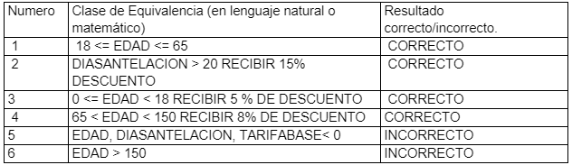

# LAB3-CVDS
> ## Integrantes
> 1. Andres Rocha
> 2. David Herrera


 

# AeroDescuentos 

> Se está desarrollando para una aerolínea su módulo de liquidación de tiquetes aéreos. Para el mismo, se tiene una función que aplica descuentos a la tarifa base del vuelo dependiendo del tiempo de antelación de la reserva y la edad del pasajero. Los descuentos SON ACUMULABLES.
> 
> Normativa 005, sobre los descuentos:
>
>- 15% de descuento sacando el billete con antelación superior a 20 días. 
>
>- 5% a los pasajeros con edad inferior a 18 años y 8% a los pasajeros con edad superior a 65 
años. 

> La siguiente es la especificación de la función que se usará en el módulo del cálculo de los descuentos: 
>
>
>
> calcular la tarifa de cada billete según el trayecto, la antelación 
en la que se obtiene el billete y la edad del pasajero, de acuerdo 
con la normativa 005. 
>
```
@param tarifaBase valor base del vuelo 

@param diasAntelacion dias de antelación del vuelo 

@param edad - edad del pasajero 

@throws ExcepcionParametrosInvalidos [XXXXXXXXXXXXXXXXXXXXXXXXXXX] 

  
public long calculoTarifa(long tarifaBase, int diasAntelacion, int edad) 
```

> De acuerdo con lo indicado, y teniendo en cuenta que NO hay precondiciones, en qué casos se debería arrojar una excepción de tipo ExcepcionParametrosInvalidos?. Agregue esto a la especificación. 
> ## respuesta
>Los tres parámetros deben ser mayores o igual a 0 
>
>La edad debe ser menor 150 

  

>En la siguiente tabla enumere un conjunto de clases de equivalencia que -según usted- creen una buena división del conjunto de datos de entrada de la función anterior: Número Clase de equivalencia (en lenguaje natural o matemático). Resultado correcto /incorrecto. 
> ## Respuesta



  

> Para cada clase de equivalencia, defina un caso de prueba específico, definiendo: parámetros de entrada y resultados esperados. 
>
> ## respuesta
> Tarifa base = $100.000, dias de aentelacion = 5 y edad = 10. Resultado = 5 % de descuento. Total a pagar = $95.000 
>
> Tarifa base: $100.000, edad: 34 años, días de antelación: 35, 15% de descuento, Total a pagar: $85.000 
>
> Tarifa base: $200.000, días de antelación:  3 días, edad:70 años, 8% de descuento,Total a pagar: $184.000 
>
>Tarifa base: $200.000, días de antelación:  3 días, edad:50 años, 0% de descuento,Total a pagar: $200.000 
>
> Tarifa base: $100.000, edad: 180 años, días de antelación: 35, se lanza la excepción por edad inválida. 
>
> Tarifa base: $0, edad: 30 años, días de antelación: 35 días, se lanza la excepción por tarifa base inválida. 

 

>A partir de las clases de equivalencia identificadas en el punto 2, identifique las condiciones límite de frontera de las mismas. 
>
> ## respuesta
> - 18 años 
>
> - 65 años 
>
> - 150 años 
>
> - 20 días 
>
> - 0 años 
>
> - 0 días 
>
> - 0 pesos  

 

>Para cada una de las condiciones de frontera anteriores, defina casos de prueba específicos 
>
> ## Respuesta
> **Tarifa base –0 pesos:**
> - Tarifa base: $0, edad: 30 años, días de antelación: 35 días, se lanza la excepción por tarifa base inválida. 
> - Tarifa base: -$1, edad: 30 años, días de antelación: 35 días, se lanza la excepción por tarifa base inválida. 
> - Tarifa base: $1, edad: 30 años, días de antelación: 35 días, 15% de descuento, total a pagar: $0.85
>
> **Edad-0 años:** 
> - Tarifa base: $100.000, edad: -1 años, días de antelación: 35 días, se lanza la excepción por edad inválida. 
> - Tarifa base: $100.000, edad: 0 años, días de antelación: 45 días, se lanza la excepción por edad inválida. 
> - Tarifa base: $100.000, edad: 1 años, días de antelación: 35 días, 20% de descuento, total a pagar: $80.000 
>
> **Días de antelación-0 días:**
> - Tarifa base: $100.000, edad:20 años, días de antelación: -1 días, se lanza la excepción por error en la edad 
> - Tarifa base: $100.000, edad:20 años, días de antelación: 0 días, se lanza la excepción por error en la edad 
> - Tarifa base: $100.000, edad:20 años, días de antelación: 1 días, 15% de descuento, total a pagar: $85.000 
>
> **Edad –18 años:** 
> - Tarifa base: $100.000, edad:17 años, días de antelación: 30 días, 20% de descuento, total a pagar: $80.000 
> - Tarifa base: $100.000, edad:18 años, días de antelación: 30 días, 15% de descuento, total a pagar: $85.000 
> - Tarifa base: $100.000, edad:19 años, días de antelación: 30 días, 15% de descuento, total a pagar: $85.000 
>
> **Edad –65 años:** 
> - Tarifa base: $100.000, edad:64 años, días de antelación: 25 días, 15% de descuento, total a pagar: $85.000 
> - Tarifa base: $100.000, edad:65 años, días de antelación: 25 días, 15% de descuento, total a pagar: $85.000 
> - Tarifa base: $100.000, edad:66 años, días de antelación: 25 días, 23% de descuento, total a pagar: $77.000 
>
> **Edad –150 años:** 
> - Tarifa base: $100.000, edad:149 años, días de antelación: 18 días, 8% de descuento, total a pagar: $92.000 
> - Tarifa base: $100.000, edad:150 años, días de antelación: 3 días, se lanza la excepción por error en la edad 
> - Tarifa base: $100.000, edad:151 años, días de antelación: 3 días, se lanza la excepción por error en la edad 
>
> **Días de antelación –20 días:** 
> - Tarifa base: $100.000, edad:35 años, días de antelación: 19 días, 0% de descuento, total a pagar: $100.000 
> - Tarifa base: $100.000, edad:35 años, días de antelación: 20 días, 0% de descuento, total a pagar: $100.000 
> - Tarifa base: $100.000, edad:35 años, días de antelación: 21 días, 15% de descuento, total a pagar: $85.000 

 

 

 

 

 

 

 

 
